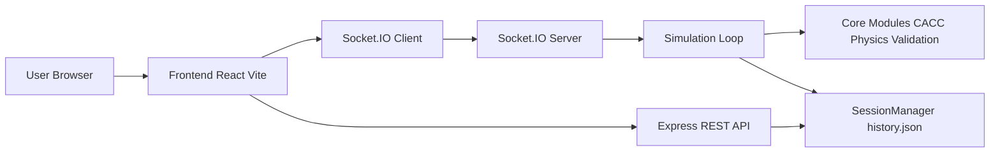
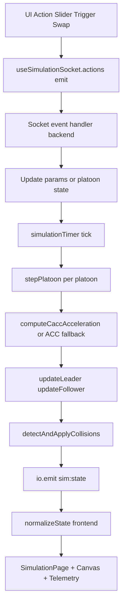

# Full Codebase Guide - V2V 5G Platooning Simulator

Dokumen ini disusun untuk membantu Anda mempelajari **seluruh codingan aplikasi** (backend + frontend + konfigurasi) secara sistematis.

## 1) Gambaran Besar Arsitektur

- Frontend mengirim kontrol, parameter, trigger, dan swap via Socket.IO.
- Backend menjalankan loop simulasi periodik (`tick`) lalu broadcast state terbaru.
- Hasil sesi tersimpan ke `backend/data/history.json` via `SessionManager`.
- Halaman dashboard/settings membaca/mengubah history lewat endpoint REST.

## 2) Struktur Folder Utama

- `backend/src`: server realtime, loop simulasi, CACC/ACC, kinematika, validasi, persistence.
- `frontend/src`: halaman UI, hooks komunikasi, komponen cockpit, telemetry, visualisasi analisis.
- `docs`: dokumentasi (file ini).
- `backend/data/history.json`: penyimpanan riwayat eksperimen.

## 3) Konfigurasi & Build

### Root
- `package.json`
  - `install:all`: install dependency backend + frontend.
  - `dev:backend`, `dev:frontend`: jalankan development server.
  - `build`: build backend + frontend.
  - `check`: lint frontend + build penuh.

### Backend Config
- `backend/.env.example`
  - Variabel: `PORT`, `CLIENT_ORIGIN`, `SERVE_STATIC`, `FRONTEND_DIST_PATH`, `SIM_TICK_MS`, `SIM_BROADCAST_MS`.
- `backend/src/config.ts`
  - `numberFromEnv(name, fallback)`: parsing number dengan fallback.
  - `booleanFromEnv(name, fallback)`: parsing boolean dari env.
  - `config`: object runtime config server/simulasi.
  - `canServeFrontend()`: cek apakah static frontend bisa diserve.
- `backend/tsconfig.json`
  - Compile TypeScript backend ke `dist/`.

### Frontend Config
- `frontend/.env.example`
  - `VITE_BACKEND_URL` endpoint backend.
- `frontend/src/config.ts`
  - `appConfig.backendUrl`: resolve URL backend (env atau same-origin saat production).
- `frontend/vite.config.ts`
  - Plugin React untuk Vite.
- `frontend/eslint.config.js`
  - ESLint JS + TypeScript + React hooks + react-refresh.
- `frontend/tsconfig.json`, `frontend/tsconfig.app.json`, `frontend/tsconfig.node.json`
  - Build setup aplikasi React + vite config typing.

## 4) Backend - Detail Per File

## 4.1 `backend/src/sim/types.ts`

### Peran
Definisi tipe domain simulasi (kendaraan, parameter, telemetry, state).

### Tipe penting
- `VehicleState`
  - Posisi longitudinal `x`, lane `y`, lane kontinu `wy`, `heading`, `targetLane`.
  - Dinamika: `speed`, `accel`, `brake`, `crashed`.
  - Transfer FSM: `transferPhase`, `transferTargetLane`, `stabilizeStartMs`, `headwayOverride`, `forceAcc`.
  - Integrasi fix terbaru: `predecessorId` untuk predecessor chain deterministic.
- `SimulationParams`
  - Parameter CACC + jaringan (`targetSpeed`, `timeHeadway`, `latencyMs`, `packetLossPercent`, `v2vTopology`, dsb).
- `Telemetry`
  - Status kontrol/jaringan/spacing yang ditampilkan di HUD frontend.
- `SimulationState`
  - Snapshot yang dibroadcast ke frontend.

## 4.2 `backend/src/sim/cacc.ts`

### Peran
Mesin longitudinal control (CACC dan fallback ACC).

### Fungsi
- `computeCaccAcceleration(input: CaccInput)`
  - Hitung `desiredGap`, `actualGap`, `spacingError`, `relativeSpeed`.
  - Terapkan feedforward berdasarkan `topology`:
    - `PF`: pakai `predecessorAccel`.
    - `L2A`/`Hybrid`: pakai `leaderAccel`.
  - Output: `{ accelCmd, spacingError }`.
- `computeAccFallbackAcceleration(input)`
  - Mode radar-only saat V2V jelek.
  - Headway lebih konservatif (`max(2.0, timeHeadway*1.6)`).
  - Output sama: `{ accelCmd, spacingError }`.

## 4.3 `backend/src/sim/networkEmulator.ts`

### Peran
Emulasi latensi + packet loss untuk paket leader.

### Kelas `NetworkEmulator`
- `push(packet, latencyMs, packetLossPercent)`
  - Simulasikan packet drop; paket lolos masuk queue dengan `deliverAt`.
- `receive()`
  - Ambil paket yang sudah jatuh tempo.
  - Jika belum ada, fallback ke `lastGoodPacket`.

## 4.4 `backend/src/sim/physics.ts`

### Peran
Update kinematika leader/follower serta steering lane-change.

### Konstanta penting
- `MAX_ACCEL`, `MAX_BRAKE`, `MAX_SPEED`.
- `FOLLOWER_MAX_DECEL_MS2` = 6.
- `FOLLOWER_EMERGENCY_DECEL_MS2` = 9 (override emergency).
- `LANE_WIDTH_M`, steering constants (`MAX_HEADING_RAD`, `MAX_STEER_RATE`, `K_STEER`, dst).

### Fungsi
- `clamp(v, lo, hi)`
  - Utility pembatas nilai.
- `steer(v, speed, dt)`
  - Dua mode:
    - Trajectory maneuver (sinus smooth step) bila field maneuver terpasang.
    - Steering proporsional fallback.
  - Output `heading` dan `wy`.
- `updateLeader(leader, dtSec, throttle, brake)`
  - Hitung `rawAccel`, `speed`, apply `steer`, update `x`.
- `updateFollower(follower, dtSec, accelCmd, opts?)`
  - Clamp akselerasi dengan batas decel dinamis (`opts.maxDecelMs2`).
  - Integrasi fix emergency brake.

## 4.5 `backend/src/sim/sessionManager.ts`

### Peran
Sampling telemetry, hitung metrik sesi, simpan/kelola history.

### Type
- `AnalysisSample`: sample periodik untuk chart.
- `HistoryRecord`: metadata sesi + series.

### Kelas `SessionManager`
- `reset()`: reset state sesi.
- `recordCollision()`: counter collision.
- `recordHz(hz)`: simpan sample frekuensi loop.
- `recordControlMode(isAccFallback)`: statistik ACC fallback.
- `getCollisionCount()`, `getCurrentHz()`: getter.
- `addSample(...)`: tambahkan sample setiap interval (200 ms).
- `getSeries()`: ambil series aktif.
- `save(packetLossPercent)`: agregasi metrik lalu persist ke `history.json`.
- `readAll()`: baca history.
- `deleteRecord(id)`, `renameRecord(id,newName)`, `deleteAllRecords()`: CRUD history.

### Helper lokal
- `ensureHistoryDir()`, `average(values)`.

## 4.6 `backend/src/sim/validation.ts`

### Peran
Sanitasi payload dari client agar aman dipakai.

### Fungsi
- `sanitizeParams(payload)`
  - Clamp numeric params sesuai batas aman.
  - Validasi enum `v2vTopology`.
  - Validasi `dynamicPathLoss` boolean.
- `sanitizeControl(payload, current)`
  - Clamp throttle/brake ke `[0,1]`.
- `isSimulationTrigger(value)`
  - Type guard trigger (`humanBrake|latencySpike|packetDrop`).
- `isVehicleSwapPayload(payload)`
  - Type guard untuk event swap.

## 4.7 `backend/src/server.ts` (inti aplikasi backend)

### Peran
Orkestrator utama:
- HTTP server + Socket.IO.
- State global simulasi.
- Tick loop realtime.
- Transfer FSM antar platoon.
- Collision detection.
- API history.

### Bagian utama

#### a) Inisialisasi global
- Konstanta safety/simulasi: collision distance, RSU spacing, cooldown transfer, follower limits.
- State mutable: `running`, `manualInput`, timer trigger, `platoons`, `emulators`, `params`.

#### b) Helper pembentuk platoon
- `platoonPrefix(index)`: prefix ID lane (`''`, `a_`, `b_`, dst).
- `makeVehicle(id,lane,x,speed)`: inisialisasi `VehicleState`.
- `makeInitialPlatoon(index, followers)`: generate leader + follower dengan spacing awal.
- `clampFollowerCount`, `clampPlatoonCount`.
- `sortPlatoonByLongitudinal(platoon)`: urutan front-to-back deterministik.
- `recomputePredecessorIds(platoon)`: update predecessor chain langsung.
- `createPlatoons(count)`: buat seluruh platoon awal.

#### c) Helper merge safety (fix Join-in-Middle)
- `minMergeGapRequiredM()`
  - Formula: `standstillDistance + targetSpeed * timeHeadway * 1.5`.
- `findMergeNeighbors(dstSortedDesc, vAx)`
  - Cari kendaraan depan (`pred`) dan belakang (`succ`) slot merge.
- `mergeSlotClearanceM(pred,succ,vAx)`
  - Hitung gap longitudinal slot dengan kompensasi panjang kendaraan.
  - Mengembalikan `{ ok, gapM, detail }`.

#### d) Helper runtime
- `effectiveLatency()`: trigger latency spike.
- `effectivePacketLoss()`: trigger packet drop.
- `getAllVehicles()`: flatten platoons.
- `isAccFallbackActive()`: threshold fallback global.
- `dynamicPathLossForVehicle(vehicleX)`: model loss berbasis jarak RSU.
- `resetSimulationState(nextCount)`: reset runtime.
- `resizePlatoonFollowers(...)`: ubah jumlah follower lane tertentu.
- `applyFollowerCountToAllPlatoons(nextFollowerCount)`.

#### e) Telemetry
- `getState()`
  - Susun `SimulationState` lengkap untuk broadcast/UI.
  - Hitung spacing error, max spacing error, avg speed, utilization, avg dynamic packet loss, dll.

#### f) Collision
- `detectAndApplyCollisions()`
  - Cek semua pasangan kendaraan di 2D (`x` + `wy*LANE_WIDTH_M`).
  - Jika tabrakan:
    - Tandai `crashed`, `speed=0`, `accel=0`, `brake=true`.
    - Record collision di session manager.
    - Emit payload collision.

#### g) Loop longitudinal utama
- `stepPlatoon(platoon, emulator, dtSec, isPrimaryPlatoon)`
  - Update leader (manual/human brake/target speed regulation).
  - Push-receive paket leader via network emulator.
  - Untuk setiap follower:
    - Resolve predecessor berdasarkan `predecessorId` + fallback index.
    - Fase FSM (`departing`, `in-transit`, `stabilizing`) ditangani inline.
    - Pilih CACC atau ACC fallback.
    - Hitung command akselerasi.
    - Emergency decel aktif saat `actualGap < desiredGap` (maks decel 9 m/s2).
  - Return array kendaraan next tick.

#### h) FSM transfer lane-change
- `stepTransferFsm()`
  - Deteksi kendaraan `in-transit` yang sudah sampai lane target.
  - Transisi ke `stabilizing` (cooldown + headway override + force ACC).

#### i) Scheduler
- `setInterval(..., config.tickMs)`
  - Jalankan `stepPlatoon` tiap lane.
  - Jalankan `stepTransferFsm`.
  - Jalankan collision detection.
  - Rekam control mode.
  - Broadcast state sesuai `config.broadcastMs`.

#### j) Socket events
- `sim:start`: start sesi baru.
- `sim:stop`: stop + save history + kirim analysis.
- `sim:reset`: reset runtime.
- `sim:updateParams`: update parameter sanitasi.
- `sim:setFollowerCount`: ubah ukuran platoon.
- `sim:control`: throttle/brake manual.
- `sim:trigger`: inject gangguan.
- `sim:swapVehicles`: swap lane sama atau transfer antar platoon.
  - Inter-platoon branch:
    - Phase 1: validasi merge slot ketat.
    - Phase 2: remove dari source + reset successor accel.
    - Phase 3: append ke destination sebagai `in-transit`.
  - Akhir event: sort + recompute predecessor chain.
- `sim:loadHistory`: kirim data analisis sesi tertentu.

#### k) HTTP API
- `GET /health`: status service.
- `GET /api/status`: snapshot state.
- `DELETE /api/sessions`: hapus semua history.
- `DELETE /api/sessions/:id`: hapus 1 history.
- `PATCH /api/sessions/:id`: rename history.

#### l) Startup/shutdown
- Start HTTP server di `config.port`.
- Tangani error `EADDRINUSE`.
- Graceful shutdown via `SIGINT`/`SIGTERM`.

## 5) Frontend - Detail Per File

## 5.1 Bootstrapping & Routing

### `frontend/src/main.tsx`
- Entry point React.
- Render `App` di dalam `BrowserRouter`.

### `frontend/src/App.tsx`
- Definisi route:
  - `/` -> `LoginPage`
  - `/dashboard` -> `DashboardPage` (protected)
  - `/simulation` -> `SimulationPage` (protected)
  - `/settings` -> `SettingsPage` (protected)
- `RequireAuth`
  - Cek `localStorage['sim-user-nim']`; jika kosong redirect login.
- Wrap semua route dengan `ErrorBoundary`.

### `frontend/src/components/ErrorBoundary.tsx`
- Menangkap error runtime React subtree.
- Jika error:
  - tampilkan fallback UI.
  - tombol refresh.

## 5.2 Types & Config

### `frontend/src/types/sim.ts`
- Mirror type dari backend untuk compile safety client.
- Termasuk `VehicleState`, `SimulationState`, `SimulationHistory`, `AnalysisSample`, dsb.

### `frontend/src/config.ts`
- Resolusi endpoint backend (`VITE_BACKEND_URL` atau fallback).

## 5.3 Hooks

### `frontend/src/hooks/useSimulationSocket.ts`

#### Peran
Satu-satunya abstraction koneksi realtime frontend-backend.

#### Fungsi internal
- `normalizeState(payload)`
  - Normalisasi field agar kompatibel dengan payload lama/baru.
  - Isi default untuk telemetry dan vehicle fields penting.

#### Hook utama `useSimulationSocket()`
- State internal:
  - `state`, `history`, `analysis`, `savedMeta`, `lastCollision`, `lastTransferRefused`, `isConnected`.
- Setup socket:
  - event `connect`, `disconnect`.
  - event data `sim:state`, `sim:history`, `sim:analysis`, `sim:saved`, `sim:collision`, `sim:transferRefused`.
- `actions` API:
  - `start`, `stop`, `reset`, `updateParams`, `setFollowerCount`, `setControl`, `trigger`, `swapVehicles`, `loadHistory`.

### `frontend/src/hooks/useDataLogger.ts`

#### Peran
Perekam telemetry client-side ke CSV (10 Hz).

#### Fungsi
- `startRecording()`: reset log + mulai timer.
- `stopRecordingAndDownload()`
  - Bangun CSV.
  - Trigger download file lokal.
- Effect interval 100 ms:
  - Baca `SimulationState` terbaru via ref.
  - Simpan `LogEntry` (delay, loss, speed, spacing error, SSI, mode).

## 5.4 Komponen Cockpit

### `frontend/src/components/ControlPanel.tsx`

#### Peran
Panel kontrol parameter, skenario gangguan, manuver swap.

#### Fungsi/komponen
- `SliderRow(...)`: reusable slider row.
- `ControlPanel(...)`
  - Tab:
    - `network`: latency/loss/bandwidth, topology, speed, time headway, follower count.
    - `scenarios`: preset jaringan + live disruptions.
    - `maneuvers`: throttle/brake manual + transfer kendaraan.
  - Memanggil callback parent (`onUpdateParams`, `onTrigger`, `onSwap`, dst).

### `frontend/src/components/SimulationCanvas.tsx`

#### Peran
Renderer visual simulasi 2D di `<canvas>` dengan animasi realtime.

#### Fungsi penting
- `clamp(value,min,max)`.
- `laneToScreenY(...)`: lane unit ke pixel Y.
- `SimulationCanvas(...)`
  - Menyimpan anim state untuk posisi halus (`displayedXRef`, `displayedWyRef`).
  - Camera follow leader.
  - Visual lane, RSU, koneksi V2V/V2I, kendaraan, badge transfer, speed/fps.
  - `handleCanvasClick(...)`: hit test kendaraan untuk selection.
  - Render loop via `requestAnimationFrame`.

### `frontend/src/components/TelemetryPanel.tsx`

#### Peran
HUD metrik realtime (status, quality jaringan, stabilitas).

#### Fungsi
- `statusColor(label)`: warna status badge.
- `numColor(value,warn,bad)`: warna metrik numerik.
- `MetricBox(...)`: item metrik.
- `TelemetryPanel(...)`
  - Menampilkan status utama + grid metrik sistem, network, stability.

### `frontend/src/components/VehicleDetail.tsx`
- Panel detail kendaraan terpilih:
  - role, speed, accel, brake, posisi, heading, lane target.

### `frontend/src/components/Toast.tsx`
- Sistem notifikasi popup.
- Auto-dismiss 3 detik via effect timer.

## 5.5 Pages

### `frontend/src/pages/LoginPage.tsx`
- Landing/hero page aplikasi.
- `launch()`: set identitas guest ke localStorage lalu navigate dashboard.

### `frontend/src/pages/DashboardPage.tsx`

#### Peran
Halaman manajemen sesi history + ringkasan statistik.

#### Fungsi
- `formatDate(value)`, `formatNumber(value,digits)`.
- `saveRename(id)`: rename history via REST `PATCH /api/sessions/:id`.
- `deleteSession(id)`: delete history via REST.
- `openSimulationConfig()` dan `startConfiguredSimulation()`: modal konfigurasi awal masuk page simulasi.
- `onLogout()`: clear auth localStorage.

### `frontend/src/pages/SimulationPage.tsx` (orchestrator UI simulasi)

#### Peran
Halaman utama eksperimen realtime.

#### Fungsi/handler penting
- `pushToast(item)`: tambah notifikasi.
- `startSimulation(platoonCount?, followerCount?)`.
- `stopAndAnalyze()`: stop sim + buka analysis setelah delay kecil.
- `handleSwap(idA,idB)`: trigger transfer + pendingSwap animation.
- `dismissToast(id)`.
- `toggleFullscreen()`.

#### Orkestrasi effect
- Respon collision/transferRefused/control-mode change ke toast.
- Keyboard shortcuts (Space, R, 1/2/3, Esc).
- Auto-load history bila masuk dari dashboard.
- Auto-start bila ada state navigation config.

### `frontend/src/pages/AnalysisPage.tsx`

#### Peran
Dashboard analisis hasil eksperimen (scorecard + chart + tabel).

#### Fungsi penting
- `formatTime(t)`, `calcAvg(values)`.
- Zoom chart helpers:
  - `makeZoom()`.
  - `ZoomableChartCard(...)`.
- Score/metric:
  - `buildScorecard(meta, series)`.
  - `MetricBadge(...)`.
- Export:
  - `exportCsv(analysis, meta)`.
- `AnalysisPage(...)`
  - Render scorecard pass/fail.
  - Render chart delay/loss/speed/spacing/SSI/RSU.
  - Render telemetry table.
  - Aksi: export CSV, print PDF, kembali simulasi/dashboard.

### `frontend/src/pages/SettingsPage.tsx`

#### Peran
Pengaturan preferensi lokal + maintenance history.

#### Fungsi
- `addToast(title,message,kind)`.
- Persist default parameter ke localStorage (`sim-default-*`).
- `handleDeleteAll()`: panggil `DELETE /api/sessions`.

## 5.6 Styling

- `frontend/src/index.css`
  - File styling terbesar aplikasi:
    - design tokens (`--accent`, `--ok`, `--warn`, dsb),
    - layout dashboard/cockpit,
    - komponen tombol/pill/card,
    - style chart/analysis/table,
    - style landing page.
- `frontend/src/App.css`
  - Styling tambahan layer App.

> Catatan: CSS tidak memiliki “fungsi” seperti TS/TSX, sehingga dokumentasi difokuskan ke peran section styling.

## 6) Alur Data End-to-End (Paling Penting Dipahami)

## 7) Runtime Sequence (Urutan Eksekusi)

1. Server backend start, inisialisasi platoon + emulator.
2. Frontend connect Socket.IO, terima state awal.
3. User menekan Start -> event `sim:start`.
4. Loop tick berjalan:
   - update leader,
   - update follower via CACC/ACC,
   - apply transfer FSM,
   - collision detection,
   - periodic broadcast.
5. Frontend menerima state:
   - normalisasi payload,
   - render ulang HUD/Canvas.
6. User Stop:
   - backend simpan history,
   - kirim `sim:saved` + `sim:analysis`.
7. Analysis page menampilkan scorecard/chart/table.

## 8) API & Event Contract Ringkas

### Socket Inbound (frontend -> backend)
- `sim:start`, `sim:stop`, `sim:reset`
- `sim:updateParams`
- `sim:setFollowerCount`
- `sim:control`
- `sim:trigger`
- `sim:swapVehicles`
- `sim:loadHistory`

### Socket Outbound (backend -> frontend)
- `sim:state`
- `sim:history`
- `sim:analysis`
- `sim:saved`
- `sim:collision`
- `sim:transferRefused`

### REST
- `GET /health`
- `GET /api/status`
- `DELETE /api/sessions`
- `DELETE /api/sessions/:id`
- `PATCH /api/sessions/:id`

## 9) Urutan Belajar yang Direkomendasikan

Jika ingin cepat paham sistem dari nol:

1. `backend/src/sim/types.ts`
2. `backend/src/sim/cacc.ts`
3. `backend/src/sim/physics.ts`
4. `backend/src/server.ts` (fokus `stepPlatoon`, `simulationTimer`, `sim:swapVehicles`)
5. `frontend/src/types/sim.ts`
6. `frontend/src/hooks/useSimulationSocket.ts`
7. `frontend/src/pages/SimulationPage.tsx`
8. `frontend/src/components/SimulationCanvas.tsx`
9. `frontend/src/pages/AnalysisPage.tsx`

## 10) Catatan Penting Kondisi Saat Ini

- Repository saat ini memiliki indikasi file path duplikat berbasis separator (`backend/src/...` dan `backend\src\...` / `frontend/src/...` dan `frontend\src\...`) dari status git sebelumnya.
- Untuk pembelajaran kode, gunakan path canonical dengan slash normal:
  - `backend/src/...`
  - `frontend/src/...`

---

Dokumen ini dibuat sebagai panduan belajar menyeluruh. Jika Anda mau, langkah berikutnya saya bisa buatkan **versi lanjutan**:
- diagram class/dependency lebih detail,
- “trace 1 skenario simulasi” tick-by-tick,
- atau glossary istilah CACC/5G agar lebih mudah untuk penulisan TA.
